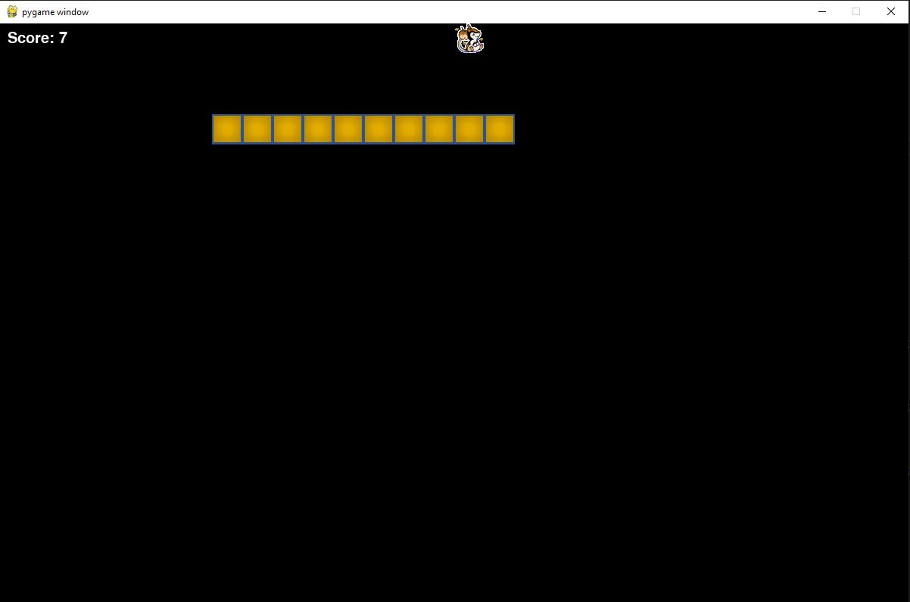

# Snake Game

## Outline
This project is a Python implementation of the classic Snake Game using the Pygame library.

## Table of Contents
1. [General Info](#general-info)
2. [Technologies Used](#technologies-used)
3. [Features](#features)
4. [Screenshots](#screenshots)
5. [Setup](#setup)
6. [Usage](#usage)
7. [Project Status](#project-status)
8. [Room for Improvement](#room-for-improvement)
9. [TO-DO](#to-do)


## General Info
The Snake Game is a classic arcade game where the player controls a snake that moves around the screen, eating food to grow longer. The objective is to avoid collisions with the snake's own body or the game boundaries.

## Technologies Used
- Python - version 3.7.9
- Pygame - version 2.0.1

## Features
- Classic snake movement mechanics
- Food generation and consumption
- Score tracking
- Game over detection

## Screenshots
Example screenshot:



## Setup
To run this project, ensure you have Python and Pygame installed. You can install Pygame using pip:

```bash
pip install pygame
```

## Usage
The Snake Game is controlled using the arrow keys (up, down, left, right). Use the arrow keys to navigate the snake around the screen, eating food to grow longer. Avoid collisions with the snake's body or the game boundaries.
```bash
python main.py
```
## Project Status
Project is: complete

## Room for Improvement
While the basic functionality of the Snake Game is implemented, there are still areas for improvement and future development:

- Implement additional features such as speed increase as the snake grows
- Add sound effects and background music
- Implement different levels with increasing difficulty

## To Do
- Implement different game modes (e.g., timed mode, endless mode)
- Improve the game's graphical assets for a more polished appearance
